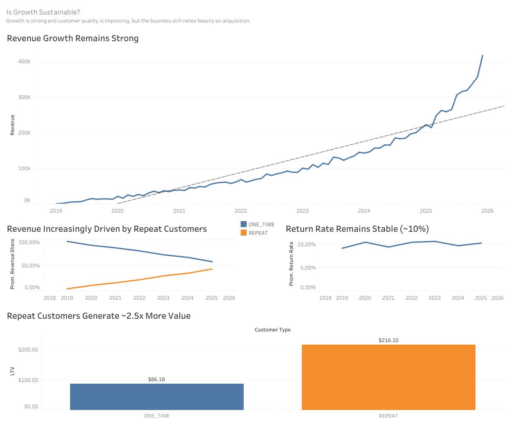

# 📊 Is Growth Sustainable? — E-commerce Analysis

## 📖 Overview

**ES**  
Proyecto de Business Analytics cuyo objetivo es diagnosticar por qué un e-commerce de moda (no lujo) podría estar creciendo de forma menos sostenible de lo esperado, analizando el comportamiento de clientes, la calidad del revenue y la estructura del negocio.

**EN**  
Business Analytics project aimed at diagnosing whether an e-commerce company’s growth is sustainable, by analyzing customer behavior, revenue quality, and key business drivers.

---

## 🎯 Business Question

- **ES:** ¿El crecimiento del negocio es sostenible? ¿Dónde deberíamos actuar?
- **EN:** Is the business growth sustainable? Where should we act?

---

## 🧠 Approach

Se ha seguido un enfoque estructurado:

- Definición de hipótesis de negocio  
- Identificación de métricas clave  
- Análisis exploratorio y validación  
- Construcción de dashboard ejecutivo  
- Generación de insights accionables  

---

## 🛠️ Tech Stack

- **SQL (BigQuery)** — Data extraction & transformation  
- **Excel** — Data cleaning & intermediate analysis  
- **Tableau** — Data visualization & dashboard  
- **R** — Supporting analysis  

---

## 📊 Data Source

- BigQuery Public Dataset:  
  `bigquery-public-data.thelook_ecommerce`

---

## 📈 Key Metrics

- Monthly Revenue  
- Revenue Share (First vs Repeat Customers)  
- Return Rate  
- Customer Lifetime Value (LTV)  

---

## 📊 Dashboard

The dashboard below summarizes the key findings of the analysis:

🔗 *(Opcional pero MUY recomendado)*  
[View interactive dashboard on Tableau Public](AÑADE_TU_LINK_AQUI)

---

## 🔍 Key Insights

- Revenue shows strong growth over time  
- Repeat customers represent an increasing share of revenue  
- Return rate remains stable (~10%), indicating consistent product quality  
- Repeat customers generate ~2.5x more value than one-time customers  

---

## 🎯 Conclusion

> The business is scaling with improving customer quality, but still relies heavily on acquisition.

Improving customer retention could significantly increase long-term value and reduce dependency on continuous acquisition.

---

## 📁 Repository Structure

---

## 📌 Project Status

✔ Retention analysis (one-time vs repeat)  
✔ Revenue trend analysis  
✔ Revenue quality analysis (return rate)  
✔ Customer segmentation  
✔ LTV analysis  
✔ Tableau dashboard  
✔ Final conclusions  

---
